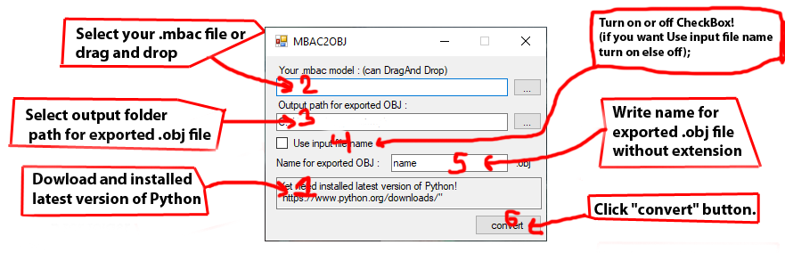
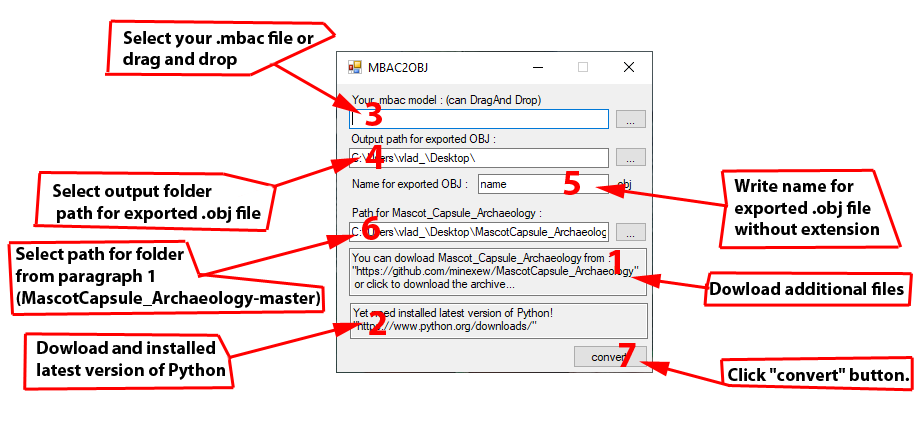

# MBAC-to-OBJ
MBAC2OBJ.exe ver.2

Now you only need python, all other files are already included in the exe file.

Instruction ver 2:
1. Dowload and installed latest version of Python (default options should be fine).
2. Select your .mbac file or drag and drop;
3. Select output folder path for exported .obj file;
4. Turn on or off CheckBox! (if you want Use input file name, turn on else off);
5. Write name for exported .obj file without extension(if you turn off paragraph '3');
6. Click "convert" button.

IMG instruction : 

//OLD VERSION
Windows shell for converting mascot capsule files (.mbac) into an understandable format for most 3D editors (.obj)!
*You must download additional files for the program to work (because the program is just a graphical shell).*

Instruction ver.1:
1. Dowload additional files "https://github.com/minexew/MascotCapsule_Archaeology"!
2. Dowload and run MBAC2OBJ.exe "https://github.com/Durik256/MBAC-to-OBJ/raw/master/MBAC2OBJ.exe";
3. Dowload and installed latest version of Python (default options should be fine).
4. Select your .mbac file or drag and drop;
5. Select output folder path for exported .obj file;
6. Write name for exported .obj file without extension;
7. Select path for folder from paragraph 1(MascotCapsule_Archaeology-master).
8. Click "convert" button.
IMG instruction : 
