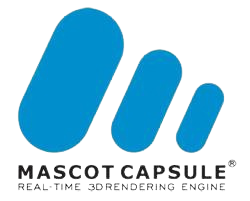

<h1 align="center">
   
  </a>
   
  Mascot Capsule 3D
   
</h1>

* The two 3D API on Sony Ericsson mobile phones are Hi Corporation's Mascot Capsule 3D V3 and JSR-184, which describes the Mobile 3D Graphics (M3G) API for the Java 2 Mobile Edition (J2ME). Both API support high-quality model rendering, using transparent color blending and appearance properties, plus applying texture maps to the model's surfaces. Mascot Capsule V3 had already been field tested and offers opportunities to migrate 3D applications from existing BREW CDMA or DoJa/i-mode devices to the J2ME platform on GSM/UMTS phones. Each of these API takes a different approach to solving the same problem of rendering 3D models quickly while consuming few platform resources.

* The Mascot Capsule should not be confused with normal JSR-184 implementations. Normally the Mascot Capsule was exclusive to Sony Ericsson and Samsung, Nokia versions (which were generally brutally inferior to Sony Ericsson, in any Java ME standard) used to use normal JSR-184, as for example in Worms Forts 3D or Asphalt 3 3D

 - [Javadoc for com.mascotcapsule.micro3d.v3](https://j2me-preservation.github.io/MascotCapsule/javadoc/)
 - [List of known games](https://github.com/j2me-preservation/MascotCapsule/wiki/List-of-known-games)
